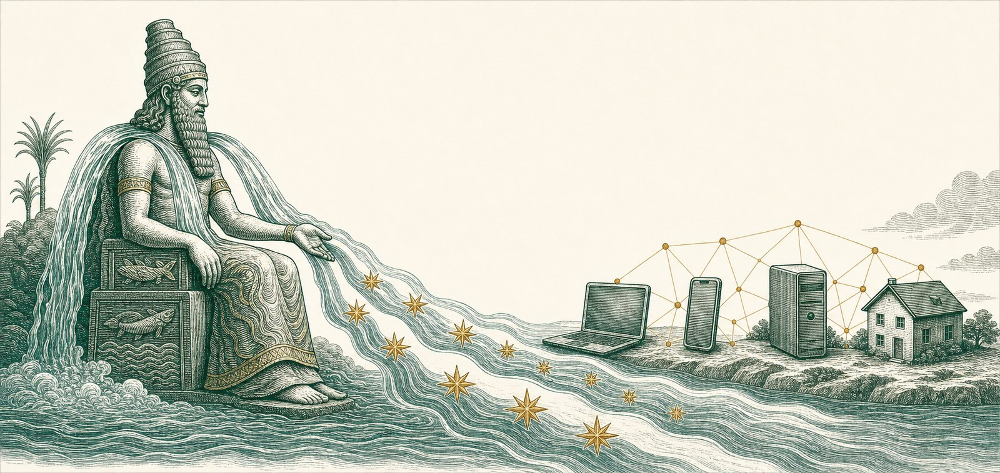
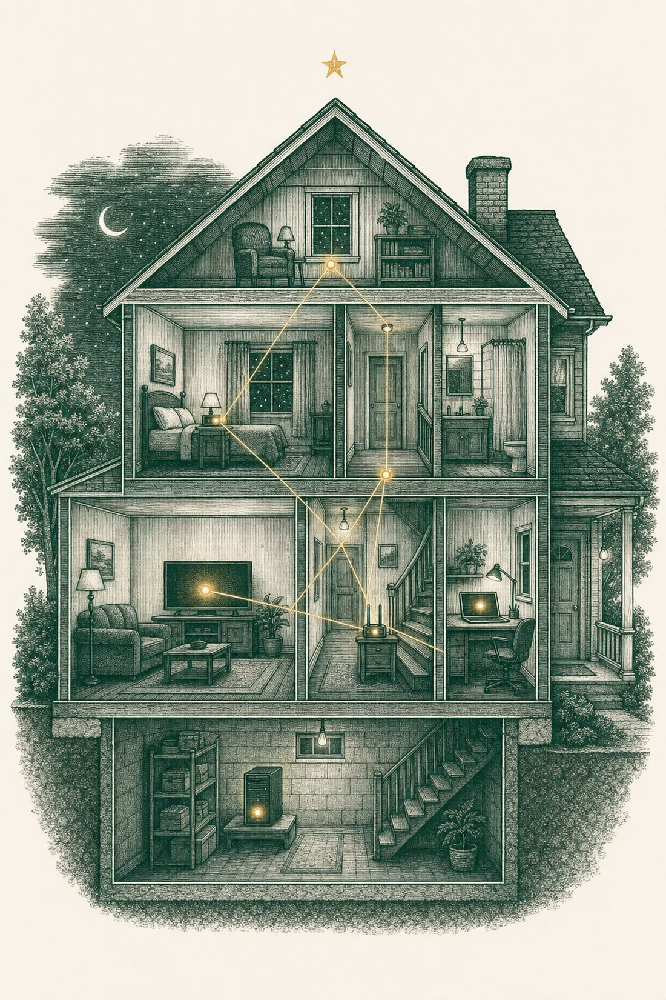
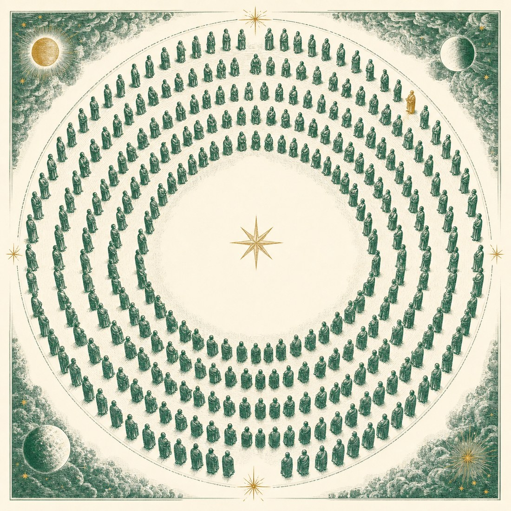

<p align="center">
  
</p>

<h1 align="center">Enki</h1>

<p align="center"><strong>Intelligence belongs on your devices, not in their datacenters.</strong></p>

<p align="center">
  <a href="https://enki.ngo"></a>
  <a href="MANIFESTO.md"></a>
  
  
  
  
</p>

<p align="center">
  
</p>

**Enki** is a public-good, non-profit, non-government association named after the Sumerian god of wisdom, fresh water and craft — the one who, when the gods voted to flood mankind, leaked the plan and taught a mortal to build a boat. Intelligence was hoarded above; a leak saved humanity. Everything we do is written from his side of that argument.

The cost of intelligence has collapsed. Our answer to the centralised AI frenzy:

> **High-level AI should be rare, licensed and accountable — everyday AI should be everywhere, local, and effectively free.**

This repository is Enki's home in the open: the manifesto, the doctrine, and the entire enki.ngo website — every file, in public, from day one. As Enki grows, everything that matters will live here.

---

## Start here

| | |
|---|---|
| 📜 **[The Manifesto](MANIFESTO.md)** | A letter on the state of intelligence — ten articles, a postface, **81 references**. The founding document; everything else derives from it. |
| 🏛️ **[Governance — the 300](docs/GOVERNANCE.md)** | How the association is run: 300 founding seats, one member one ballot, the annual mutual audit, the 3× compensation rule. |
| 🕸️ **[Wally & the local mesh](docs/WALLY.md)** | Our ambition: the local AI datacenter in every home, behind one open interface. |
| 📐 **[The standard we need](docs/STANDARD.md)** | Four clauses that would make local intelligence as ordinary as a lightbulb. |
| 📊 **[The Registry & the Models](docs/REGISTRY.md)** | What software really costs now, and the open models we validate for small hardware. |
| 🔧 **[The website](docs/WEBSITE.md)** | How this zero-dependency site is built, run and deployed. |
| ❓ **[FAQ](docs/FAQ.md)** | Short answers to the questions we get most. |

## The six pillars

1. **The Manifesto** — a referenced letter on why the AI capex frenzy is the wrong bottleneck ([read it](MANIFESTO.md))
2. **Wally** — our ambition: an open-source AI interface that treats local, everyday models as first-class citizens ([the plan](docs/WALLY.md))
3. **The Registry** — a public dataset of products that are ≥90% vibe-coded, with tools, models and total USD cost declared
4. **The Models** — a member-validated directory of open models best adapted to self-hosting on limited hardware — a laptop, a desktop, even a phone
5. **The Institute** — socio-economic and cultural research on what abundant intelligence does to societies
6. **The Advisory** — consultancy that carries that evidence into policy rooms and funds the association's public-good work

<p align="center">
  
</p>

## The local AI datacenter

The real invention is not a chat window. It lives in the local mesh — **your local AI datacenter** — where every device whose NPU or GPU can carry a small model connects over WiFi and shares the load behind a single API/MCP interface. That interface runs alongside a fully open-source fork of LibreChat and an engine sourced from Ollama — we call it **Wally**, and the whole bundle the **Wally Package**.

Wally does not exist yet. It is what we are assembling the 300 to build. [Read the full ambition →](docs/WALLY.md)

## The 300

<p align="center">
  
</p>

Enki is an association you belong to, not a newsletter you subscribe to. The founding core is **limited to 300 seats** — 299 individuals plus Paul Fleury, the founder. There is **no fee and no payment**: applicants are selected on what they can contribute — skills, networks or capital/donations — not on what they can pay. Membership is for **individuals only**, each ID-verified and interviewed, confirmed one by one. Decisions are taken by **DAO-signed votes — one member, one ballot**. Once a year, the whole 300 conduct a mutual audit: the 10% judged to have contributed least leave, and 30 new recruits step up from the pipeline. [How governance works →](docs/GOVERNANCE.md)

→ **Apply at [enki.ngo](https://enki.ngo)** — every application is read by a person; nobody gets in, or gets passed over, automatically.

## This repository

| Path | Purpose |
|---|---|
| [`MANIFESTO.md`](MANIFESTO.md) | The full manifesto letter — ten articles, the postface, all 81 references |
| [`docs/`](docs/) | The doctrine, one document per pillar |
| [`index.html`](index.html) | The whole site: hero, manifesto, standards, Wally, registry, models, institute, membership |
| [`style.css`](style.css) | Design system — warm paper palette, Zodiak/Satoshi/JetBrains Mono, light + dark themes |
| [`app.js`](app.js) | Theme, modals, registry search/filter/sort, submission wizard, membership application |
| [`data.js`](data.js) | Seed dataset for the registry of ≥90% vibe-coded builds + the model directory |
| [`assets/`](assets/) | The mark, the banner and the engravings |

### Running locally

No build step, no dependencies:

```bash
python3 -m http.server 8080
# open http://localhost:8080
```

More in [docs/WEBSITE.md](docs/WEBSITE.md).

## Licence

Code is released under the [MIT licence](LICENSE.md); the manifesto, documents and illustrations under [CC BY-SA 4.0](LICENSE.md). Share it, translate it, argue with it — with attribution, and keep it open.

## Colophon

Designed and built ~100% by AI agents, directed by a human — exactly the way of working the registry documents. Warm paper palette, forest green, Sumerian gold. Typeset in Zodiak, Satoshi and JetBrains Mono.

---

<p align="center">
  <sub>Paul Fleury · Founder & 1st of the 300 · Lisbon, August 2026</sub><br/>
  <sub>© Enki Association · <a href="https://enki.ngo">enki.ngo</a></sub>
</p>
