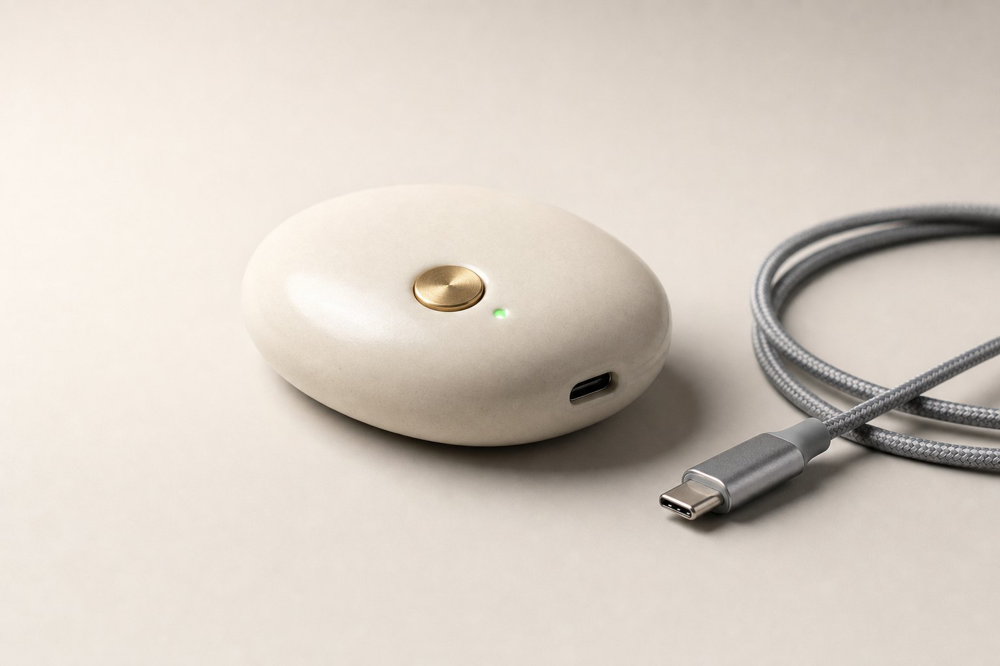

  

<h1 align="center">The Enki device</h1>

<em>A local AI datacenter in your pocket. Our objective — it does not exist yet.</em>

---

**The device doesn't exist yet.** These are renders, not photographs. Designing and building it is precisely what the 300 are being assembled for. This page describes an objective, stated plainly so it can be judged — and joined.

## What it is

One box, the size of the slim USB-C pocket battery you already carry. Inside: silicon sized for open models, a WiFi mesh radio, and one job — answer the intelligence your other devices ask for, so the question never has to leave for a datacenter. No screen, no account, no subscription. You switch it on; everything else is a conversation between your devices.

## What it does

1. **Runs the models itself.** A curated set of open models runs on the box's own silicon — drawn from the member-validated [model directory](MODELS.md), sized to its compute, quantised for its memory. The everyday tier of intelligence, on hardware you own.
2. **Meshes with everything around it.** It never works alone if it doesn't have to. Over WiFi it enrols the capable machines nearby — laptop, desktop, TV box — into one local mesh, and routes each task to whichever chip can carry it best.
3. **One standard port for every client.** The whole mesh presents itself as a single localhost API/MCP endpoint. Any AI client — Claude, Perplexity, LibreChat, ChatGPT, or the assistant in your glasses, watches or phones — docks to it without a driver, a subscription or anyone's permission.
4. **Always carrying the best models.** Whenever it touches a network — meshing with your devices, or reaching the web through them — it pulls verified, signed updates to the models it carries. Effortless to keep current: the best open models, always, with no button to press.
5. **On. Off. That is the interface.** No LED screen, no menus on the box. One power button. A companion mobile app — Bluetooth and WiFi — connects, configures and updates it.
6. **Private by construction.** Conversations, embeddings and memory stay on the device and its mesh. Nothing phones home unless you tell it to.

## The spec, as we intend it

| | |
|---|---|
| **Form factor** | Slim pocket-battery class; USB-C |
| **Interface** | One power button — no screen |
| **Compute** | Efficient AI silicon sized for small open models |
| **Models** | Curated open weights, signed and auto-updated |
| **Mesh** | WiFi enrolment of nearby capable devices |
| **Protocol** | Localhost API/MCP — the open standard we are drafting |
| **Clients** | Any AI app or device that speaks the standard |
| **Price** | Free, or strict no-margin — distribution is the mission |

## Why a box, when you have a phone

Sustained inference throttles a phone within minutes and drains it within hours — token generation is bound by memory bandwidth and heat, and a phone has little of either to spare. A dedicated box carries the load without touching your battery, and outside your safe AI environments — home, office — it **is** the environment: a portable local AI datacenter in your pocket, an alternative to calling the cloud from wherever you happen to stand.

## Distributed like a public good

The objective is not a margin; it is reach. We will try to put the device in as many human hands around the world as possible — **distributed free, or at a strict no-margin price** — because everyday intelligence should be owned like a flashlight, not rented like a mainframe.

## The path

1. **Specify.** The [standard](STANDARD.md) — model currency, mesh enrolment, gateway recognition, neutral custody — is the device's contract with the world.
2. **Prototype.** Reference hardware and firmware, fully open — schematics, board files, the model runtime and the mesh layer.
3. **Distribute.** Manufacturing partners, non-profit funding, and a price of zero or cost — as many hands as possible.

Everything ships open: hardware, firmware and models.

---

  Part of the <a href="../README.md">Enki repository</a> · <a href="../MANIFESTO.md">Manifesto, Article VI</a> · <a href="https://enki.ngo">enki.ngo</a>

