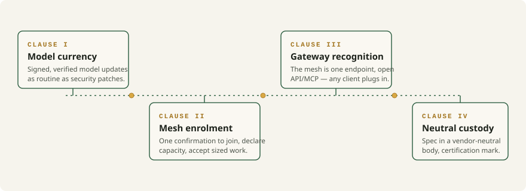

<h1 align="center">The standard we need</h1>

<em>Four clauses that would make local intelligence as ordinary as a lightbulb.</em>

  

---

For the local AI datacenter to ship in every device rather than live in a hobbyist's weekend, one international standard has to exist. We can already name its four clauses. This page carries Article VII of the [manifesto](../MANIFESTO.md), where each claim is referenced.

## Clause I — Model currency

Any device shipping a GPU or NPU receives **signed, verified updates to the small models it carries** — as routine and as trusted as security patches are today. A model is not a one-time factory decision; it is a maintained component of the device.

## Clause II — Mesh enrolment

A new device joins the household mesh with **a single confirmation**. It declares what it can carry — memory, throughput, thermal envelope — and accepts work sized to that declaration, the way Matter commissions a lightbulb in seconds.

## Clause III — Gateway recognition

The mesh presents itself as **one endpoint speaking an open API/MCP dialect**, so any AI client — Wally, of course, included, but equally any chatbot you happen to prefer — can plug into it without a driver, a subscription or anyone's permission.

## Clause IV — Neutral custody

The specification lives in a **vendor-neutral body** where rivals hold each other honest, with a certification mark consumers can trust — and, where industry stalls, a legislature willing to finish the job as Europe did with the common charger.

---

## Nothing here asks for new physics

Each clause is already running somewhere — for lightbulbs, chargers or chat tools. What is missing is only the decision to apply the same instruments to intelligence. Drafting, arguing for and defending that standard — in standards bodies, in policy rooms, in public — will be among the first mandates of the Enki Institute's policy arm.

**Read it in context:** [Manifesto — Article VII](../MANIFESTO.md), with references for Matter commissioning, the EU common-charger directive and the API/MCP precedents.

---

  Part of the <a href="../README.md">Enki repository</a> · <a href="https://enki.ngo">enki.ngo</a>

